## 🌪 A Rundown on NTP Insights

**NTP Insights** is a web application platform developed by Western Engineering research interns to support the <a href="https://www.uwo.ca/ntp/">Northern Tornadoes Project</a>'s capacity in collecting, analyzing, and sharing important research data in a meaningful way.

> ```01``` **Sign-in Process**

Users can create an NTP Insights account using one of two methods: by entering their email address or by linking their Discord account. If using an email address, a verification email will be sent with a link to proceed. If using a Discord account, a pop-up will prompt the user to authorize the account.

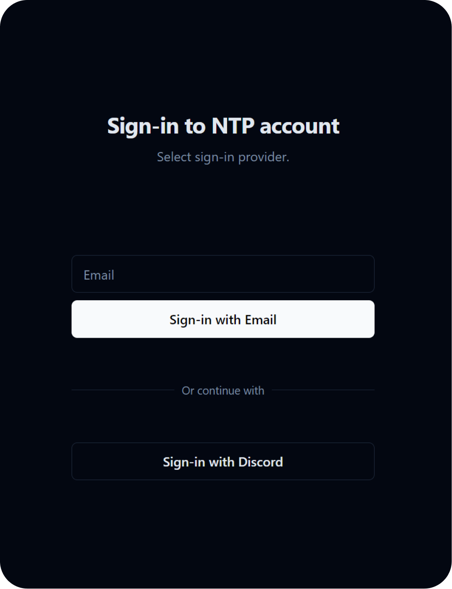

> ```02``` **Account Customization**

Upon initial account creation, the user will be prompted to set their profile settings, including their name and profile picture (optional). Profile settings can be accessed at any time through the main dropdown in the top right corner of the screen.

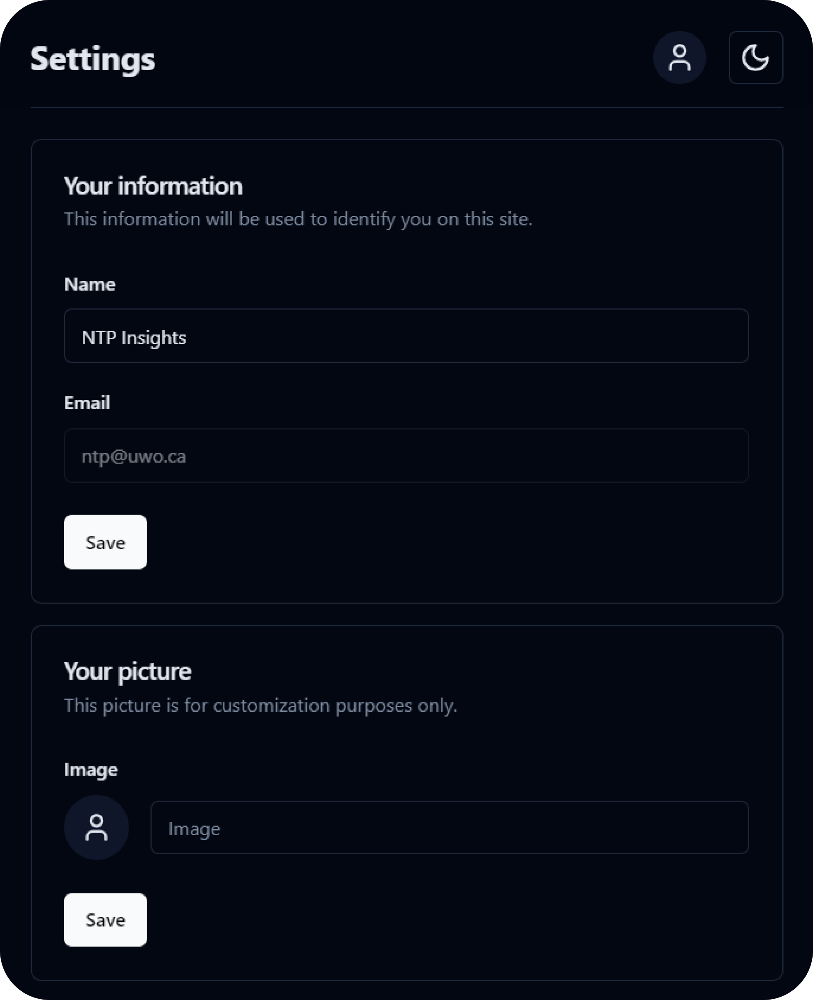

> ```03``` **Authentication**

For full access to the NTP Insights feature set, a user must be ```NTP Authenticated```. Any currently authenticated user can authenticate other users by navigating to ```Settings > Authenticate Users```.

> ```04``` **Main Dashboard and Navigation**

The main dashboard provides quick access to the three NTP Insights software tools. The navigation bar at the top persists on every NTP Insights page and includes a main dropdown with access to all NTP Insights pages and a button to configure the website theme.

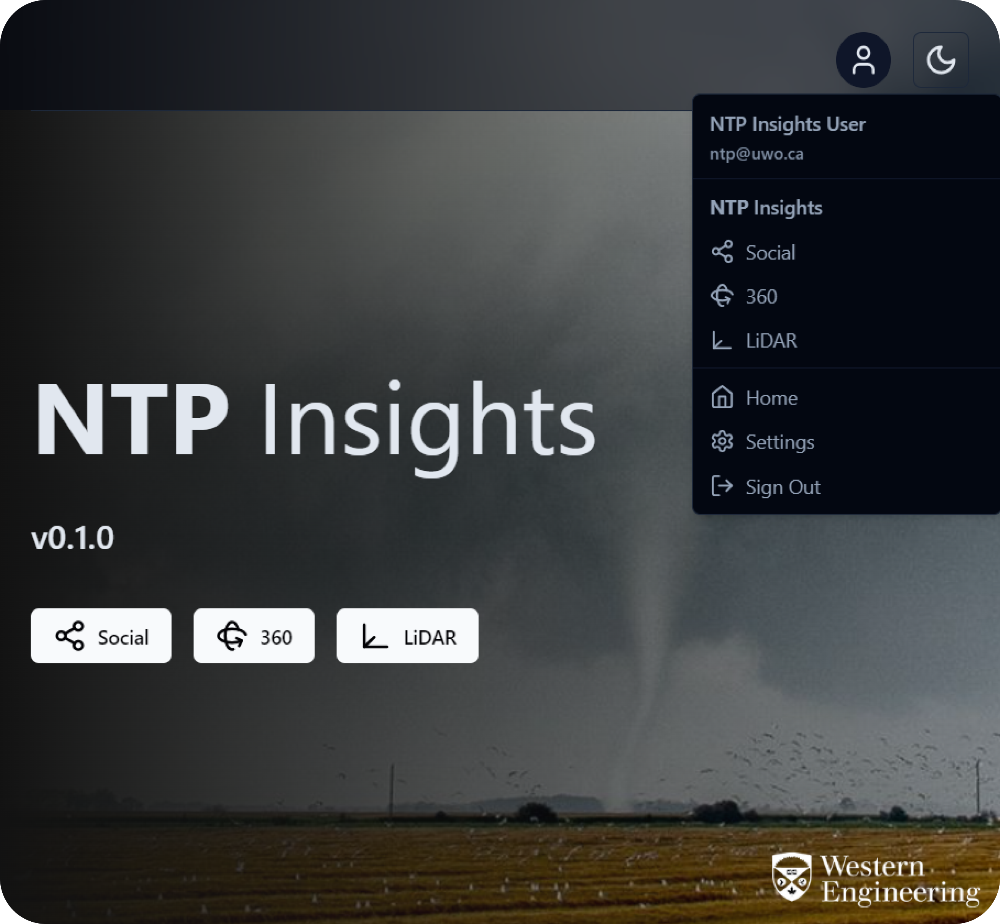

## NTP Social

NTP Social is a social media scrapping tool that utilized LLMs to scrape social media posts from Twitter, with the ability to add more sites. It will take these posts and grade them based on a classification model running on `co:here` that will determine the relevance of the post to the NTP. The user can then view the posts and their grades, and can then choose to contact that user if future information is needed.

> ```01``` Social Dashboard

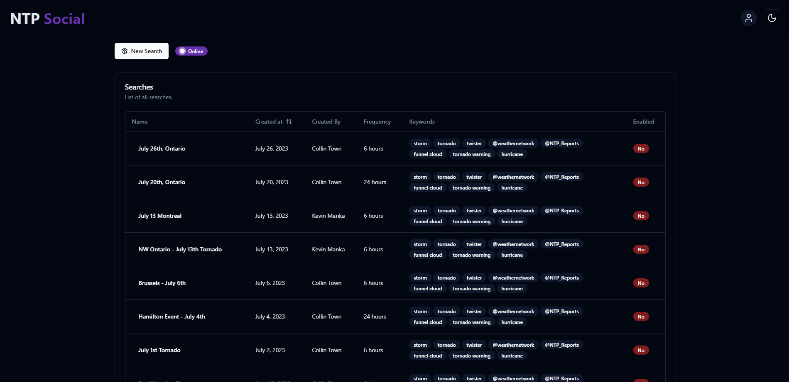

The dashboard is where you can view all of the current and past searches. You can also create a new search from here. The table also displays if the current search is enabled. If it is enabled, it will run based on the frequency defined in the search (every 6 to 48 hours).

> ```02``` Creating a New Search

Creating a new search is easy with the built in preset values. You can also choose to create a custom search with your own values. The search will be saved and can be viewed in the dashboard.

- **Search Name**: The name of the search. This will be displayed in the dashboard.
- **Date Range**: The date range of the search. This will be the date range of the posts that are scraped and how long the scraper will run.
- **Keywords**: The keywords that will be used to search for posts. The scraper will search for posts that contain these keywords.
- **Negative Keywords**: The negative keywords that will be used to search for posts. The scraper will not search for posts that contain these keywords.
- **Frequency**: The frequency of the search. This will determine how often the scraper will run.
- **Max Results**: The maximum number of results that will be scraped. The scraper will stop once this number is reached.
- **Location**: Using the map marker, location based keywords will be added to the search. The scraper will search for posts that contain these keywords.

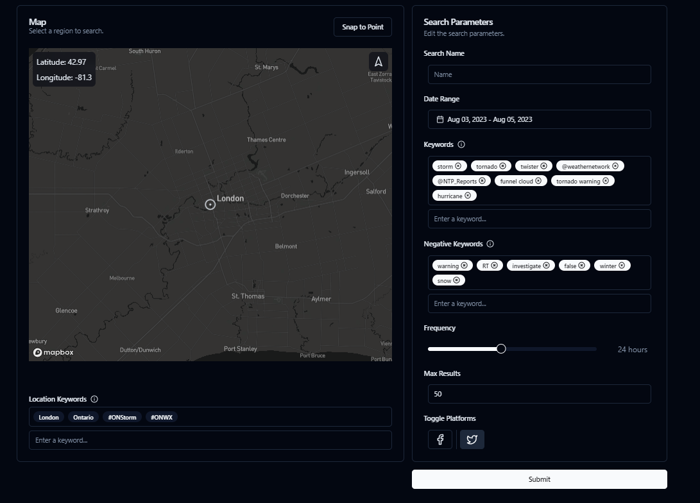

## NTP 360

NTP 360 enables the uploading, viewing, and sharing of 360-degree panorama captures taken on severe storm damage surveys on-screen and in virtual reality (VR) using  ```React Three XR``` (based on ```WebXR```). Users can move through and around the street-level imagery and toggle between ```Before``` and ```After``` to compare changes that occurred from the storm.

> ```01``` 360 Dashboard

The 360 dashboard allows users to create a new event path upload and access the table of pre-existing uploads.


> ```02``` Uploading New Event Paths

After providing event details such as the event name, folder name, and date, the upload process is broken into 3 distinct uploads: the ```framepos.txt``` file, the event panoramas, and the comparison panoramas.

***Uploading the framepos file.*** NTP 360 is designed around the ```NCTech iSTAR Pulsar``` camera workflow. Once data formation through ```NCTech Immersive Studio``` is complete, a ```framepos``` text file is created, storing all of the necessary geospatial data for each photo. NTP 360 parses this data and uses it to plot map points, populate a ```Details``` pane alongside the 360 view, and more.

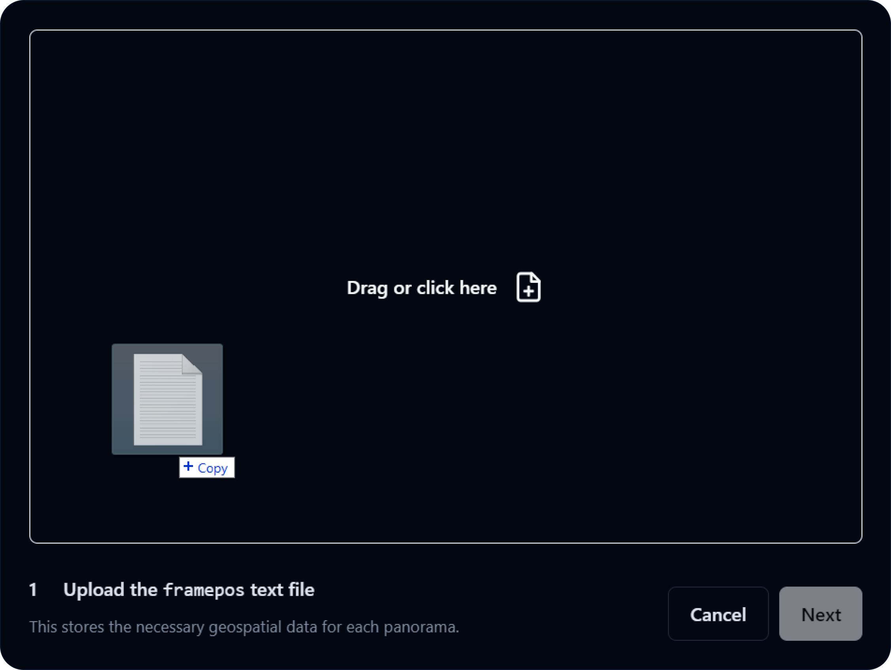

***Uploading the event panoramas.*** After counting the number of data entries in the ```framepos.txt``` file, NTP 360 determines the number of panoramas that it expects to be uploaded. Note that only numerically chronological file names, i.e., ```0000000000```, ```0000000001```, ```0000000002```, etc. are accepted.

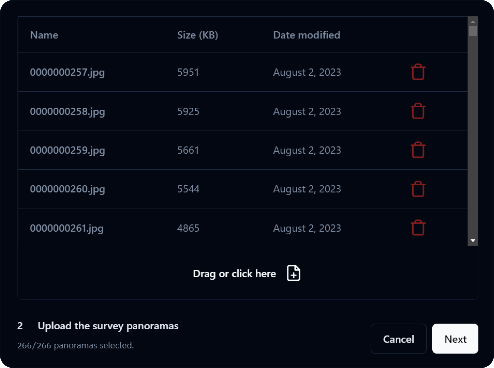

***Uploading the comparison panoramas.*** NTP 360 references the latitude and longitude values for each panorama and uses the ```Google Street View API``` to fetch the closest available panorama for each of the uploaded ```iSTAR Pulsar``` panoramas. A copyable/downloadable list of panorama IDs is then given to be entered into ```Street View Download 360``` for exporting. Note that each comparison panorama file must be named after its panorama ID.

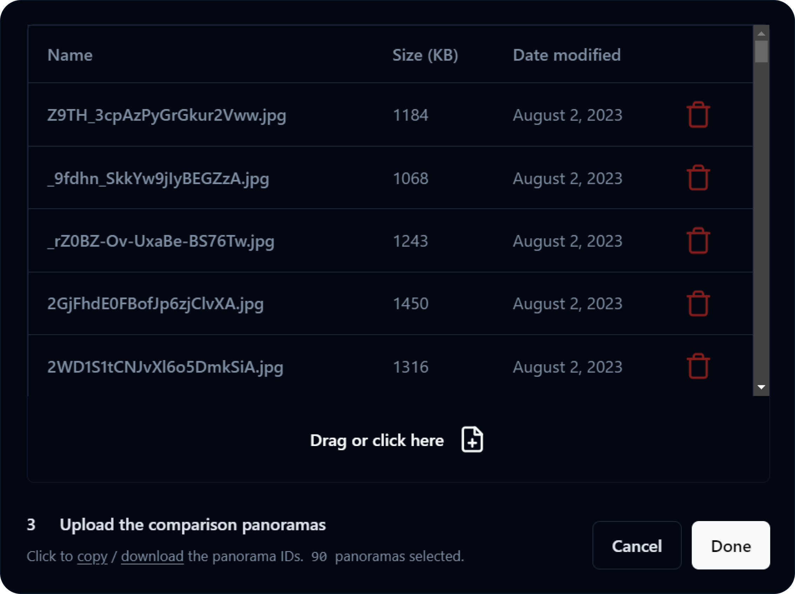

> ```03``` Viewing Event Path Uploads (Screen and VR)

NTP 360 uses ```Three.js``` to create a spherical texture map view of each panorama and ```CameraControls``` to look around the view. The following are the controls for the 360 view:

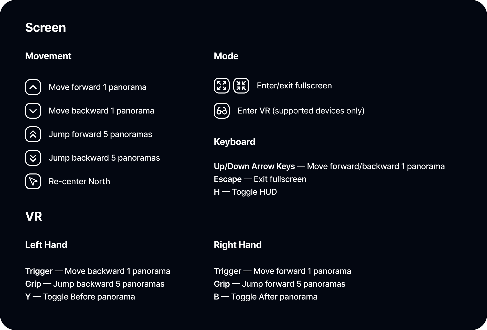

Alongside the 360 view is a ```Details``` pane that offers useful information about the panorama and more granular sequence controls. There is also an interactive map powered by the ```Mapbox API``` that plots a clickable point for every 5 images along the event route.


> ```04``` Sharing Event Path Uploads

From the 360 dashboard, users can copy a shareable public link that leads directly to its associated event path upload. An inline frame of the 360 view can also easily be embedded onto other webpages.

> ```05``` Additional Resources

[Click here](docs/CAMERA.md) to learn more about using the ```iSTAR Pulsar camera``` and ```Street View Download 360```.

##  NTP LiDAR

Another way to capture visual data from a storm survey is in the form of LiDAR pointclouds. In conjunction with images from ground/aerial photography, LiDAR data can be used to identify failure modes of natural and man-made structures. 

NTP LiDAR is a way to quickly view LiDAR pointcloud scans without having to download a standalone program. Just upload your ```.las``` or ```.laz``` file and you're off to the races!

> ```01``` LiDAR Dashboard

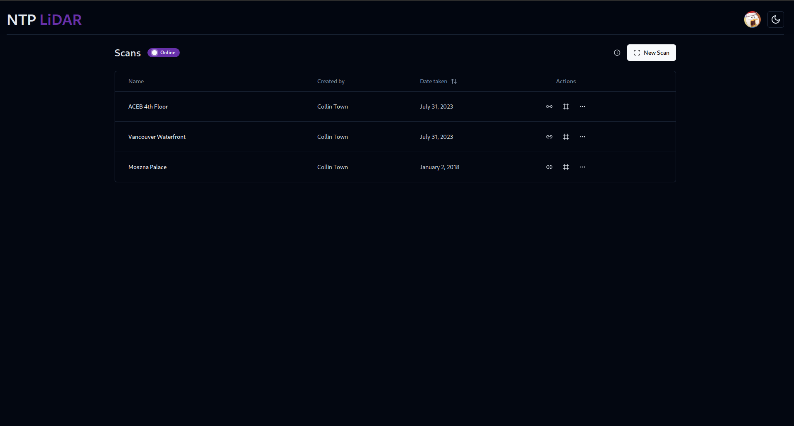

The LiDAR dashboard allows users to create a new scan upload and access the table of pre-existing uploads.

> ```02``` Uploading New Scans

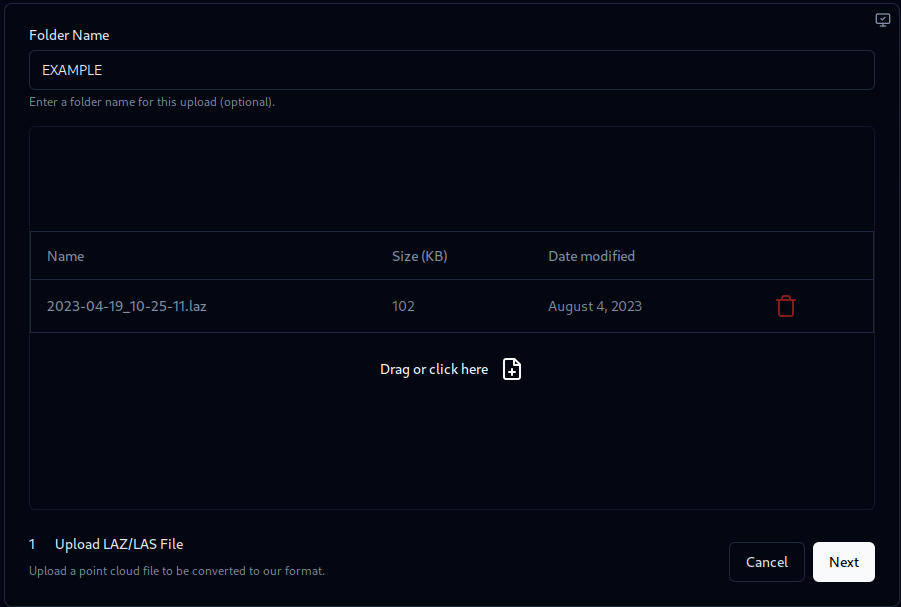

The upload dialog requires the user to upload the pointcloud file(s) in the ```*.las``` format or its compressed variant, ```*.laz```. As a part of the upload process, metadata relating to scan/event dates, scan location, and scan type (e.g. ground vs. aerial) are required to be entered in.  

After the upload process is completed, the backend automatically converts this to a binary format that the renderer can use.

***Speaking of which...***

> ```03``` Viewing Scan Uploads

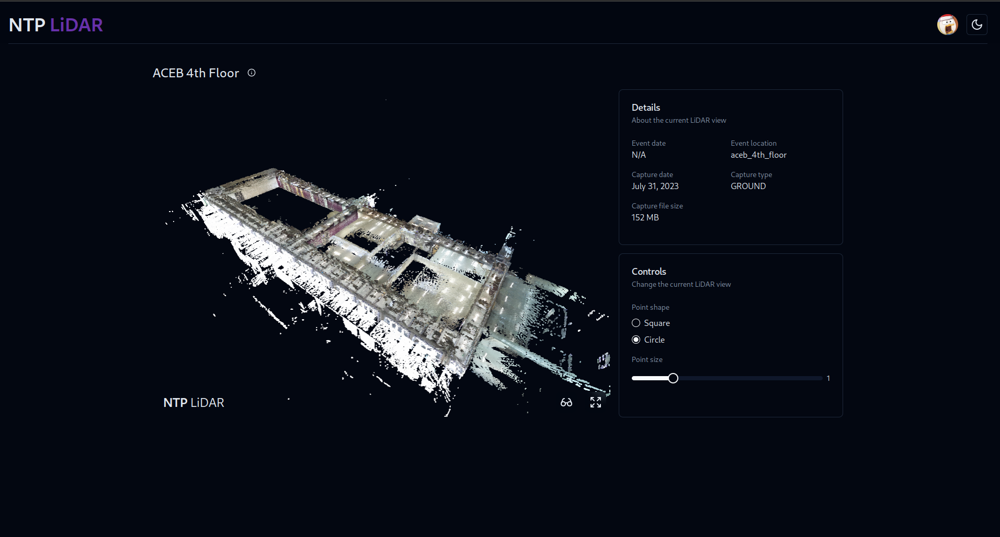

The LiDAR pointclouds are rendered using ```Potree Core``` which is a simplifed library of the venerable ```Potree``` software. As such, the core foundation of the renderer is built around ```THREE.js```. To move the camera around the pointcloud, a combination of ```FlyControls``` and ```PointerLockControls``` is used to provide cursor and keyboard control.

Such controls are further detailed in the graphic below:

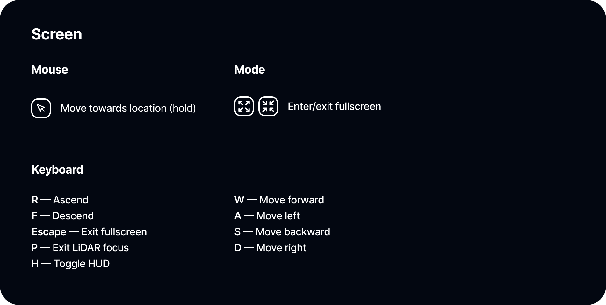

> ```04``` Sharing Scan Uploads

Just like with the 360 dashboard, users can copy a shareable public link that leads directly to its associated LiDAR scan entry. An inline frame of the pointcloud view can also easily be embedded onto other webpages.
 