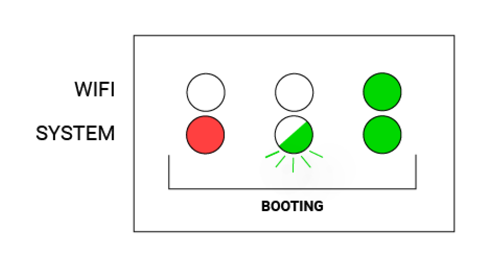
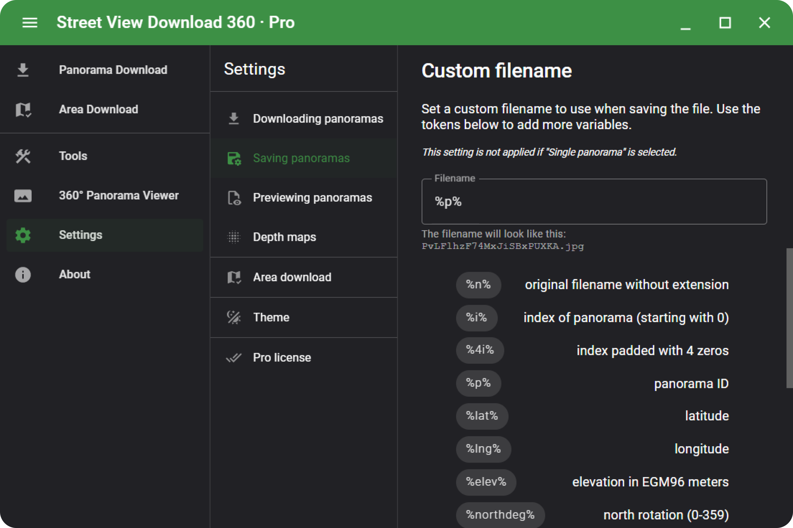
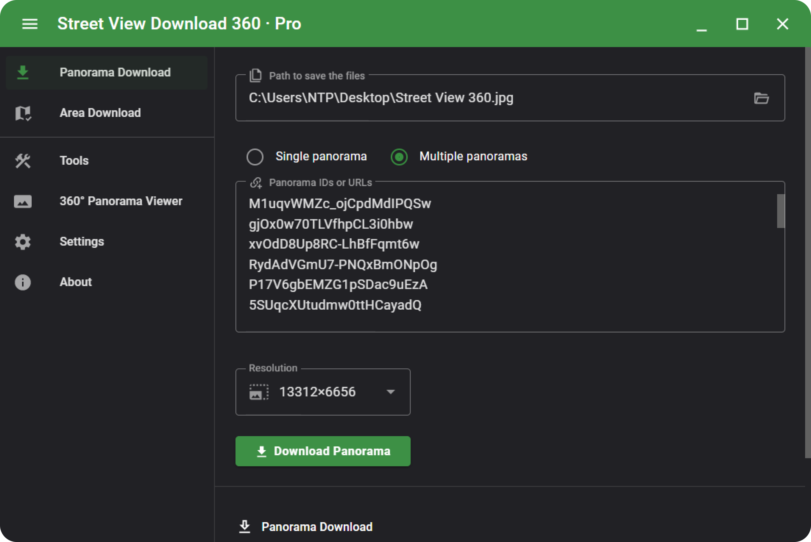

# Creating and Uploading Event Path Panorama Captures Using the ```iSTAR Pulsar Camera``` and ```NTP 360```

## Operating the ```iSTAR Pulsar Camera```

> ```01``` Setting up the Camera Hardware

To turn on the ```iSTAR Pulsar Camera```, first connect it to an available power source. Then, ensuring that the mode selector switch is set to ```Right```, press and release the power button. Wait for 2-3 minutes until the bottom light (system status) and the top light (wifi status) both turn from red to solid green.



For more information on setting up the camera hardware, including mounting the device and drawing power from a vehicle, [click here](https://istarpulsar.zendesk.com/hc/en-us/articles/360001997054-How-to-use-iSTAR-Pulsar).

> ```02``` Setting up the Camera Software

To connect to the ```iSTAR Pulsar Camera```’s local network, navigate to ```Settings > …```. Select the ```pulsar-*****``` network, and enter ```pulsar-1234``` as the password.

The camera is controlled using the ```iSTAR Pulsar``` app, available on ```Android``` devices. Ensuring you are connected to the ```pulsar-*****``` network, navigate to ```>``` in the ```iSTAR Pulsar``` app.

## Using ```NCTech Immersive Studio``` for Data Formation

> ```01``` Raw Camera Files

For each capture sequence, the ```iSTAR Pulsar Camera``` generates a folder containing a ```.onctd``` file, a ```.onctv``` file, and an ```info.txt``` file. To process these files into panorama images, launch ```NCTech Immersive Studio``` and navigate to ```Data Formation```. For ```Input```, select the folder containing these files, and for ```Output```, select a desired folder to export the panoramas to.

> ```02``` Configuring the Necessary Data Formation Settings

Under the ```Options``` dropdown, change the number of frames to process from ```-1``` to the desired number. Under the ```Advanced``` dropdown, select ```Add Mirror Ball``` so that the exported images will have a mirror ball effect over the otherwise black region. Once these and other desired settings are configured, click ```Process``` and wait for ```Status``` to be ```Done```.

## Retrieving Comparison Panoramas from ```Street View Download 360```

> ```01``` Overview

```NTP 360``` allows users to upload older street-level imagery from ```Google Street View``` to create before/after comparisons on damage sites. After uploading a set of panoramas, ```NTP 360``` creates a copyable or downloadable list of panorama IDs based on the closest locations to the ```iSTAR Pulsar``` panorama uploads. ```Street View Download 360``` is a desktop application that can process these panorama IDs in bulk and export a folder of comparison panoramas.

> ```02``` Configuring the Street View Download 360 Settings

Before your first export, it is important to ensure that your file name settings are configured correctly, as ```NTP 360``` uses the panorama ID in the file name to appropriately match up before/after panoramas.

Navigate to ```Settings > Saving panoramas > Custom filename```. In the ```Filename``` text input field, enter ```%p%```. This will name each image file after its panorama ID.



Back in ```Panorama Download```, set the desired file path to export to, select ```Multiple Panoramas```, paste the list of panorama IDs, and set the desired image resolution. Once ready, click ```Download Panorama```.



## Creating a New Event Path in ```NTP 360```

Learn more about uploading to NTP 360 [here](../README.md/#ntp-360).